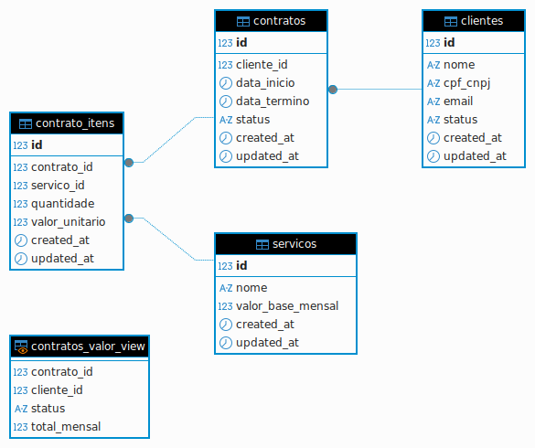
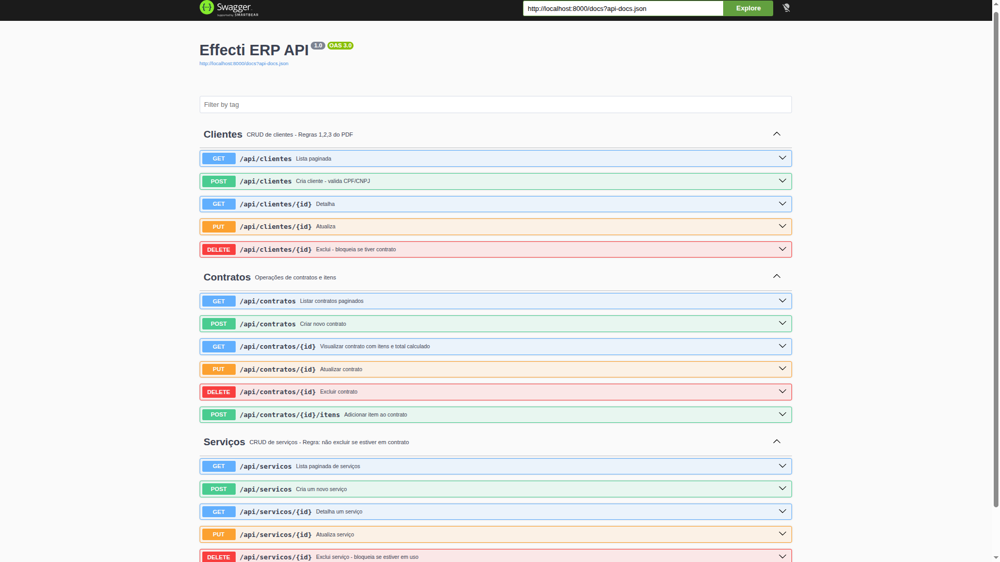

# Effecti Code Challenge - Teste Técnico PHP (ERP – Contratos e Serviços)

Desenvolvimento de um ERP simplificado focado em Contratos e Serviços recorrentes.
O projeto é monorepo com backend e frontend separados, roda no Docker utilizando as tecnologias Laravel (API REST) em PHP 8.2 + Vue.js 3 e MySQL.

## Stack

- **Backend**: Laravel 8.0 (PHP 7.4) - API REST
- **Frontend**: Vue.js 3 + Vite
- **Banco**: MySQL 8
- **Docker / docker-compose**

## Configuração do arquivo .ENV

Renomeie o arquivo [.env.example](https://github.com/julianomacielferreira/effecti-code-challenge/blob/main/backend/.env.example) para **.env**
e altere as seguintes variáveis de ambiente:

```bash
APP_NAME=Effecti_ERP
APP_ENV=local
APP_KEY=base64:Jwj0pOe8Bo8vkP4uYi5rMeEGKLEAtzs4DjslwbTqx/M= # use the output of the `php -r "echo md5(uniqid()).\"\n\";" command`
APP_DEBUG=true
APP_URL=http://localhost
APP_TIMEZONE=UTC

DB_CONNECTION=mysql
DB_HOST=mysql
DB_PORT=3306
DB_DATABASE=effecti_erp
DB_USERNAME=effecti
DB_PASSWORD=z0x9c8v7

```

## Banco de Dados

O arquivo [schema.sql](./docker/mysql/schema.sql) contém o código DDL tabelas.

Abaixo segue o diagrama que mostra as tabelas para modelo de dados do projeto.



As seguintes regras são garantidas através da modelagem de dados com as respectivas restrições:

Tabela `clientes`

- `cpf_cnpj VARCHAR(14) UNIQUE`
  - Garante unicidade.
  - O `CHECK` aceita só 11 ou 14 dígitos.
  - A validação do dígito verificador (CPF/CNPJ) é feita no Laravel com Rule, porque SQL não calcula Digito Verificador.
- `email UNIQUE`
  - impede duplicidade.
- `status ENUM('Ativo','Inativo')`
  - No código é bloqueado `INSERT INTO contratos` se cliente == "Inativo".
  - `ON DELETE RESTRICT` no contrato não deixa excluir nenhum cliente que tenha contrato.

Tabela `servicos`

- `valor_base_mensal DECIMAL(10,2) CHECK > 0`
  - Impede serviço grátis ou negativo.
  - É o valor padrão, mas o contrato pode mudar o preço (negociação).
- `UNIQUE nome`
  - Evita nomes de serviço duplicados.

Tabela `contratos`

- `cliente_id FK`
  - Um cliente pode ter vários contratos.
- `data_termino NULL`
  - Contrato indeterminado é permitido.
- `CHECK data_termino >= data_inicio`
  - Consistência temporal.
- `status`
  - quando virar 'Cancelado', no Laravel é travado o endpoint de update (Regra Extra: "impedir edição de contrato cancelado").

Tabela `contrato_itens`

- `UNIQUE (contrato_id, servico_id)`
  - Não deixa adicionar o mesmo serviço duas vezes, a quantidade é somada dinamicamente.
- `quantidade > 0 e valor_unitario > 0`
  - Restrições.
- `ON DELETE RESTRICT` em servico
  - Não deixa apagar um Serviço se ele está vinculado a um contrato ativo.
- `ON DELETE CASCADE` em contrato
  - Se deletar um contrato, os itens somem juntos.


## Como adicionar uma nova regra para cálculo total do contrato

Foi utilizado o padrão `Strategy` na classe `App\Services\CalculadoraDeContrato`.

Cada regra recebe o Contrato e devolve um novo valor total. A Calculadora só soma os resultados — ela não sabe como cada desconto funciona.

Por exemplo, para adicionar uma nova regra que cria um desconto de aniversário você pode seguir o seguinte exemplo:

1. Crie uma nova classe Rule no arquivo `app/Rules/Contrato/DescontoAniversarioRule.php`

```php
<?php
namespace App\Rules\Contrato;

use App\Models\Contrato;

class DescontoAniversarioRule implements ContratoRule
{
    public function aplicar(Contrato $contrato): float
    {
        // 10% no mês de aniversário do cliente
        return now()->month == $contrato->cliente->data_nascimento->month 
            ? -$contrato->valor_total * 0.10 
            : 0;
    }

    public function descricao(): string
    {
        return 'Desconto Aniversário 10%';
    }
}
```

2. Crie um teste isolado `tests/Unit/Rules/DescontoAniversarioRuleTest.php`:

```php
/** @test */
public function aplica_10_porcento_no_mes_aniversario()
{
    $contrato = Contrato::factory()->create();
    $regra = new DescontoAniversarioRule();
    $this->assertEquals(-$contrato->valor_total*0.1, $regra->aplicar($contrato));
}
```

3. Config – adicione a nova regra ativa em `config/contrato.php`:

```php
return [
    'regras' => [
        \App\Rules\Contrato\DescontoPorQuantidadeRule::class,
        \App\Rules\Contrato\DescontoFidelidadeRule::class,
        \App\Rules\Contrato\AcrescimoPremiumRule::class,
        // adicione novas regras aqui
        \App\Rules\Contrato\DescontoAniversarioRule::class,
    ],
];
```

4. A injeção já acontece no `App\Providers\AppServiceProvider`:

```php
 public function register()
    {
        $this->app->singleton(CalculadoraDeContrato::class, function ($app) {

            $classes = config('contrato.regras', []);

            if (empty($classes)) {
                $classes = [SemDescontoRule::class];
            }

            $regras = array_map(function ($classe) use ($app) {
                return $app->make($classe);
            }, $classes);

            return new CalculadoraDeContrato($regras);
        });
    }
```

### Vantagens dessa abordagem

- Para expandir ou remover as regras não é necessário modificar o Controller ou Service: basta só criar a classe e adicionar no contrato config ou remover a linha de uma já existente.
- Para alterar a sequência de aplicação é só mudar a ordem no array.
- Para desativar basta comentar a linha no config, sem necessidade de deletar outros códigos da aplicação.

## Inicializar o Projeto com Docker

É necessário instalar o **[Docker](https://docs.docker.com/install/)** como o **[Docker Compose](https://docs.docker.com/compose/install/)** na sua máquina.

Execute os seguintes comandos no terminal:

```bash
$ docker-compose build
```

```bash
$ docker-compose up
```

A saída será similar a essa:

```bash
Starting effecti_mysql    ... done
Starting effecti_frontend ... done
Starting effecti_backend  ... done
Starting effecti_nginx    ... done
Attaching to effecti_frontend, effecti_mysql, effecti_backend, effecti_nginx
effecti_mysql | 2026-06-12 11:33:35+00:00 [Note] [Entrypoint]: Entrypoint script for MySQL Server 8.0.46-1.el9 started.
effecti_nginx | /docker-entrypoint.sh: /docker-entrypoint.d/ is not 
effecti_nginx | /docker-entrypoint.sh: Launching /docker-entrypoint.
...
effecti_mysql | 2026-06-12T11:33:36.208021Z 1 [System] [MY-013576] [InnoDB] InnoDB initialization has started.
...
```

## Migrations

As migrations (diretório `/backend/database/migrations`) rodam sempre que o container é iniciado. Para executá-las manualmente baste rodar o comando:

```bash
$ docker-compose exec backend php artisan migrate --env=testing
```

## Testes Unitários

Para executar os testes unitários localizados no diretório `backend/app/tests` basta executar o seguinte comando na raiz do projeto:

```bash
$ docker-compose exec backend php artisan test
```

A saída será similar a essa:

```bash
   PASS  Tests\Unit\Models\ClienteTest
  ✓ status padrao e ativo
  ✓ relacionamento contratos retorna has many

   PASS  Tests\Unit\Models\ContratoItemTest
  ✓ subtotal calcula quantidade vezes valor

   PASS  Tests\Unit\Models\ContratoTest
  ✓ accessor total mensal soma itens regra 5
  ✓ contrato inicia como ativo

   PASS  Tests\Unit\Models\ServicoTest
  ✓ cast valor base para decimal

   PASS  Tests\Unit\Repositories\ClienteRepositoryTest
  ✓ cria cliente limpando mascara
  ✓ busca por cpf ignorando mascara
  ✓ nao deleta cliente com contrato ativo
  ✓ deleta cliente sem contrato

   PASS  Tests\Unit\Repositories\ContratoRepositoryTest
  ✓ find retorna com relacionamentos
  ✓ find lanca excecao se nao existir
  ✓ create persiste dados
  ✓ paginate filtra por status

   PASS  Tests\Unit\Repositories\ServicoRepositoryTest
  ✓ cria servico
  ✓ busca por id
  ✓ paginate filtra por nome
  ✓ atualiza servico
  ✓ deleta servico sem vinculo
  ✓ nao deleta servico vinculado a contrato

   PASS  Tests\Unit\Requests\StoreClienteRequestTest
  ✓ rules tem cpfcnpj e unique
  ✓ prepare limpa mascara antes de validar

   PASS  Tests\Unit\Requests\StoreContratoItemRequestTest
  ✓ servico obrigatorio
  ✓ servico deve existir
  ✓ quantidade deve ser positiva
  ✓ valor unitario deve ser positivo
  ✓ nao permite servico duplicado no mesmo contrato
  ✓ aceita dados validos

   PASS  Tests\Unit\Requests\StoreContratoRequestTest
  ✓ aceita dados validos
  ✓ data inicio obrigatoria
  ✓ data termino deve ser maior que inicio

   PASS  Tests\Unit\Requests\UpdateClienteRequestTest
  ✓ rules tem cpfcnpj e unique ignore
  ✓ prepare limpa mascara
  ✓ permite manter mesmo cpf no update
  ✓ nao permite cpf de outro cliente

   PASS  Tests\Unit\Requests\UpdateContratoRequestTest
  ✓ aceita patch vazio
  ✓ rejeita cliente inexistente
  ✓ aceita cliente existente
  ✓ rejeita status invalido
  ✓ aceita status ativo
  ✓ aceita status cancelado
  ✓ rejeita data termino menor que inicio
  ✓ aceita data termino igual inicio
  ✓ aceita data termino maior que inicio
  ✓ nao permite editar contrato cancelado
  ✓ permite editar contrato ativo

   PASS  Tests\Unit\Rules\Contrato\AcrescimoPremiumRuleTest
  ✓ aplica acrescimo quando tem servico premium
  ✓ nao aplica acrescimo sem servico premium
  ✓ detecta premium case insensitive
  ✓ nome retorna identificador correto
  ✓ funciona no pipeline com outras regras

   PASS  Tests\Unit\Rules\Contrato\DescontoFidelidadeRuleTest
  ✓ aplica 3 porcento para cliente antigo
  ✓ nao aplica para cliente novo

   PASS  Tests\Unit\Rules\Contrato\DescontoPorQuantidadeRuleTest
  ✓ nao aplica desconto abaixo de 10
  ✓ aplica 5 porcento para 10 a 19
  ✓ aplica 10 porcento para 20 ou mais
  ✓ nome retorna identificador

   PASS  Tests\Unit\Rules\Contrato\SemDescontoRuleTest
  ✓ retorna mesmo valor

   PASS  Tests\Unit\Rules\CpfCnpjRuleTest
  ✓ aceita cpf valido sem mascara
  ✓ aceita cpf valido com mascara
  ✓ rejeita cpf com dv errado
  ✓ rejeita cpf sequencia repetida
  ✓ aceita cnpj valido
  ✓ aceita cnpj com mascara
  ✓ rejeita cnpj invalido
  ✓ rejeita tamanho invalido

   PASS  Tests\Unit\Services\Contrato\CalculadoraDeContratoTest
  ✓ calcula subtotal sem regras
  ✓ aplica multiplas regras em pipeline

   PASS  Tests\Unit\Services\ClienteServiceTest
  ✓ listar delega para paginate
  ✓ buscar delega para find
  ✓ criar delega para create
  ✓ atualizar busca e depois atualiza
  ✓ excluir quando nao tem contrato
  ✓ excluir lanca excecao se tem contrato

   PASS  Tests\Unit\Services\ContratoServiceTest
  ✓ listar delega para paginate
  ✓ buscar delega para find e adiciona totais
  ✓ criar delega para create
  ✓ calcular total delega para calculadora

   PASS  Tests\Unit\Services\ServicoServiceTest
  ✓ listar delega para repository paginate
  ✓ buscar delega para repository find
  ✓ criar delega para repository create
  ✓ atualizar busca e depois atualiza
  ✓ excluir busca e depois deleta
  ✓ excluir propaga excecao de dominio

   PASS  Tests\Feature\Api\ClienteControllerTest
  ✓ lista paginado
  ✓ cria cliente
  ✓ nao cria duplicado
  ✓ mostra com contagem
  ✓ atualiza
  ✓ nao exclui com contrato
  ✓ exclui sem contrato

   PASS  Tests\Feature\Api\ContratoControllerTest
  ✓ lista paginado
  ✓ cria contrato
  ✓ mostra com totais
  ✓ atualiza contrato
  ✓ exclui contrato
  ✓ adiciona item
  ✓ nao adiciona item em cancelado

   PASS  Tests\Feature\Api\ServicoControllerTest
  ✓ cria servico
  ✓ nao deleta em uso

  Tests:  100 passed
  Time:   1.34s

```

## Documentação Swagger

Para acessar documentação Swagger basta acessar http://localhost:8000/api/documentation.




## Endpoints

### Clientes - Listar com filtro (GET): 

- **api/clientes?status={{Ativo|Inativo}}&search={{search}}**

Exemplo:

```bash
$ curl -s "http://localhost:8000/api/clientes?status=Ativo&search=MLOCKS" \
 -H "Accept: application/json"
```

<details>
<summary><b>Resposta</b></summary>

```json
{
   "current_page":1,
   "data":[
      {
         "id":8,
         "nome":"MLOCKS CONSULTORIA",
         "cpf_cnpj":"11222333000181",
         "email":"contato@email.com",
         "status":"Ativo",
         "created_at":"2026-06-11T23:09:24.000000Z",
         "updated_at":"2026-06-11T23:09:24.000000Z",
         "contratos_count":0
      }
   ],
   "first_page_url":"http:\/\/localhost:8000\/api\/clientes?page=1",
   "from":1,
   "last_page":1,
   "last_page_url":"http:\/\/localhost:8000\/api\/clientes?page=1",
   "links":[
      {
         "url":null,
         "label":"&laquo; Previous",
         "active":false
      },
      {
         "url":"http:\/\/localhost:8000\/api\/clientes?page=1",
         "label":"1",
         "active":true
      },
      {
         "url":null,
         "label":"Next &raquo;",
         "active":false
      }
   ],
   "next_page_url":null,
   "path":"http:\/\/localhost:8000\/api\/clientes",
   "per_page":15,
   "prev_page_url":null,
   "to":1,
   "total":1
}
```
</details>

---

### Clientes - Criar (POST): 

- **api/clientes**

Exemplo:

```bash
curl -s -X POST http://localhost:8000/api/clientes \
 -H "Accept: application/json"
 -H "Content-Type: application/json" \
 -d '{"nome":"MLOCKS CONSULTORIA","cpf_cnpj":"11.222.333/0001-81","email":"contato@email.com"}'
```

<details>
<summary><b>Resposta</b></summary>

```json
{
   "status":"Ativo",
   "nome":"MLOCKS CONSULTORIA",
   "cpf_cnpj":"11222333000181",
   "email":"contato@email.com",
   "updated_at":"2026-06-11T23:09:24.000000Z",
   "created_at":"2026-06-11T23:09:24.000000Z",
   "id":8
}
```

</details>

---

### Clientes - Recuperar por Id (GET): 

- **api/clientes/{{id}}**

Exemplo:

```bash
curl -s http://localhost:8000/api/clientes/1  \ 
  -H "Accept: application/json"
```

<details>
<summary><b>Resposta</b></summary>

```json
{
   "id":8,
   "nome":"MLOCKS CONSULTORIA",
   "cpf_cnpj":"11222333000181",
   "email":"contato@acme.com",
   "status":"Ativo",
   "created_at":"2026-06-11T23:09:24.000000Z",
   "updated_at":"2026-06-11T23:09:24.000000Z",
   "contratos_count":0
}
```

</details>

---

### Clientes - Atualizar por Id (PUT): 

- **api/clientes/{{id}}**

Exemplo:

```bash
curl -s -X PUT http://localhost:8000/api/clientes/1 \
 -H "Content-Type: application/json" \
 -d '{"status":"Inativo"}'
```

<details>
<summary><b>Resposta</b></summary>

```json
{
   "id":8,
   "nome":"MLOCKS CONSULTORIA",
   "cpf_cnpj":"11222333000181",
   "email":"contato@acme.com",
   "status":"Inativo",
   "created_at":"2026-06-11T23:09:24.000000Z",
   "updated_at":"2026-06-11T23:17:45.000000Z",
   "contratos_count":0
}
```

</details>

---

### Clientes - Deletar por Id, falha se tiver contrato. (DELETE): 

- **api/clientes/{{id}}**

Exemplo:

```bash
curl -i -X DELETE http://localhost:8000/api/clientes/8  \ 
  -H "Accept: application/json"
```

<details>
<summary><b>Resposta</b></summary>

```bash
HTTP/1.1 204 No Content
Server: nginx/1.31.1
Connection: keep-alive
X-Powered-By: PHP/7.4.33
Cache-Control: no-cache, private
Date: Thu, 11 Jun 2026 23:19:29 GMT
X-RateLimit-Limit: 60
X-RateLimit-Remaining: 58
Access-Control-Allow-Origin: *
```

</details>

---

### Servicos - Listar com filtro (GET): 

- **api/servicos?search={{search}}**

Exemplo:

```bash
$ curl -s "http://localhost:8000/api/servicos?search=OFICINA"
```

<details>
<summary><b>Resposta</b></summary>

```json
{
    "current_page": 1,
    "data": [
        {
            "id": 13,
            "nome": "Oficina Mecânica",
            "valor_base_mensal": "49.90",
            "created_at": "2026-06-12T13:26:16.000000Z",
            "updated_at": "2026-06-12T13:26:16.000000Z"
        }
    ],
    "first_page_url": "http://localhost:8000/api/servicos?page=1",
    "from": 1,
    "last_page": 1,
    "last_page_url": "http://localhost:8000/api/servicos?page=1",
    "links": [
        {
            "url": null,
            "label": "&laquo; Previous",
            "active": false
        },
        {
            "url": "http://localhost:8000/api/servicos?page=1",
            "label": "1",
            "active": true
        },
        {
            "url": null,
            "label": "Next &raquo;",
            "active": false
        }
    ],
    "next_page_url": null,
    "path": "http://localhost:8000/api/servicos",
    "per_page": 15,
    "prev_page_url": null,
    "to": 1,
    "total": 1
}
```
</details>

---

### Serviços - Criar (POST): 

- **api/servicos**

Exemplo:

```bash
curl -X POST http://localhost:8000/api/servicos \
 -H "Accept: application/json" \
 -H "Content-Type: application/json" \
 -d '{"nome":"Oficina de Bikes","valor_base_mensal":49.90}'
```

<details>
<summary><b>Resposta</b></summary>

```json
{
    "nome": "Cloud Backup",
    "valor_base_mensal": "49.90",
    "updated_at": "2026-06-12T13:11:38.000000Z",
    "created_at": "2026-06-12T13:11:38.000000Z",
    "id": 10
}
```

</details>

---

### Serviços - Atualizar por Id (PUT): 

- **api/servicos/{{id}}**

Exemplo:

```bash
curl -X PUT http://localhost:8000/api/servicos/1 \
  -H "Accept: application/json" \
  -H "Content-Type: application/json" \
 --data '{
    "nome": "Oficina 1223",
    "valor_base_mensal": 59.90
  }'
```

<details>
<summary><b>Resposta</b></summary>

```json
{
    "id": 10,
    "nome": "Oficina 1223",
    "valor_base_mensal": "59.90",
    "created_at": "2026-06-12T14:02:39.000000Z",
    "updated_at": "2026-06-12T14:03:08.000000Z"
}
```

</details>

---

### Serviços - Deletar por Id, falha se estiver em uso. (DELETE): 

- **api/servicos/{{id}}**

Exemplo:

```bash
curl -i -X DELETE http://localhost:8000/api/servicos/11 
  -H "Accept: application/json" \
```

<details>
<summary><b>Resposta</b></summary>

```bash
HTTP/1.1 204 No Content
Server: nginx/1.31.1
Connection: keep-alive
X-Powered-By: PHP/7.4.33
Cache-Control: no-cache, private
Date: Thu, 11 Jun 2026 23:19:29 GMT
X-RateLimit-Limit: 60
X-RateLimit-Remaining: 58
Access-Control-Allow-Origin: *
```

</details>

---

### Contratos - Listar (GET): 

- **api/contratos**

Exemplo:

```bash
$ curl -X GET "http://localhost:8000/api/contratos" \
  -H "Accept: application/json"
```

<details>
<summary><b>Resposta</b></summary>

```json
{
    "current_page": 1,
    "data": [
        {
            "id": 26,
            "cliente_id": 60,
            "data_inicio": "2024-01-01T00:00:00.000000Z",
            "data_termino": null,
            "status": "Ativo",
            "created_at": "2026-06-12T20:55:30.000000Z",
            "updated_at": "2026-06-12T20:58:04.000000Z",
            "valor_total": 1000,
            "cliente": {
                "id": 60,
                "nome": "MLOCKS CONSULTORIA SCSI",
                "cpf_cnpj": "11222333000181",
                "email": "contato@email.com",
                "status": "Ativo",
                "created_at": "2026-06-12T20:50:37.000000Z",
                "updated_at": "2026-06-12T20:50:37.000000Z"
            },
            "itens": [
                {
                    "id": 7,
                    "contrato_id": 26,
                    "servico_id": 18,
                    "quantidade": 10,
                    "valor_unitario": "100.00",
                    "created_at": "2026-06-12T21:01:14.000000Z",
                    "updated_at": "2026-06-12T21:01:14.000000Z",
                    "servico": {
                        "id": 18,
                        "nome": "Oficina Mecânica XSS",
                        "valor_base_mensal": "694.90",
                        "created_at": "2026-06-12T20:50:43.000000Z",
                        "updated_at": "2026-06-12T20:50:43.000000Z"
                    }
                }
            ]
        }
    ],
    "first_page_url": "http://localhost:8000/api/contratos?page=1",
    "from": 1,
    "last_page": 1,
    "last_page_url": "http://localhost:8000/api/contratos?page=1",
    "links": [
        {
            "url": null,
            "label": "&laquo; Previous",
            "active": false
        },
        {
            "url": "http://localhost:8000/api/contratos?page=1",
            "label": "1",
            "active": true
        },
        {
            "url": null,
            "label": "Next &raquo;",
            "active": false
        }
    ],
    "next_page_url": null,
    "path": "http://localhost:8000/api/contratos",
    "per_page": 15,
    "prev_page_url": null,
    "to": 1,
    "total": 1
}
```
</details>

---

### Contratos - Criar (POST): 

- **api/contratos**

Exemplo:

```bash
curl -X POST "http://localhost:8000/api/contratos" \
  -H "Accept: application/json" \
  -H "Content-Type: application/json" \
  -d '{
    "cliente_id": 60,
    "data_inicio": "2026-06-12",
    "status": "Ativo"
  }'
```

<details>
<summary><b>Resposta</b></summary>

```json
{
    "status": "Ativo",
    "cliente_id": 60,
    "data_inicio": "2026-06-12T00:00:00.000000Z",
    "updated_at": "2026-06-12T21:59:51.000000Z",
    "created_at": "2026-06-12T21:59:51.000000Z",
    "id": 27,
    "valor_total": 0,
    "itens": []
}
```

</details>

---

### Contratos - Atualizar por Id (PUT): 

- **api/contratos/{{id}}**

Exemplo:

```bash
$ curl -X PUT "http://localhost:8000/api/contratos/26" \
  -H "Accept: application/json" \
  -H "Content-Type: application/json" \
  -d '{
    "status": "Cancelado"
  }'
```

<details>
<summary><b>Resposta</b></summary>

```json
{
    "id": 26,
    "cliente_id": 60,
    "data_inicio": "2024-01-01T00:00:00.000000Z",
    "data_termino": null,
    "status": "Cancelado",
    "created_at": "2026-06-12T20:55:30.000000Z",
    "updated_at": "2026-06-12T22:01:42.000000Z",
    "valor_total": 1000,
    "itens": [
        {
            "id": 7,
            "contrato_id": 26,
            "servico_id": 18,
            "quantidade": 10,
            "valor_unitario": "100.00",
            "created_at": "2026-06-12T21:01:14.000000Z",
            "updated_at": "2026-06-12T21:01:14.000000Z"
        }
    ]
}
```

</details>

---

### Contratos - Recuperar por Id (GET): 

- **api/contratos/{{id}}**

Exemplo:

```bash
$ curl -X GET "http://localhost:8000/api/contratos/26" \
  -H "Accept: application/json"
```

<details>
<summary><b>Resposta</b></summary>

```json
{
    "id": 26,
    "cliente_id": 60,
    "data_inicio": "2024-01-01T00:00:00.000000Z",
    "data_termino": null,
    "status": "Cancelado",
    "created_at": "2026-06-12T20:55:30.000000Z",
    "updated_at": "2026-06-12T22:01:42.000000Z",
    "totais": {
        "subtotal": 1000,
        "total": 950,
        "desconto_total": 50,
        "regras_aplicadas": [
            "desconto_quantidade"
        ]
    },
    "valor_total": 1000,
    "cliente": {
        "id": 60,
        "nome": "MLOCKS CONSULTORIA SCSI",
        "cpf_cnpj": "11222333000181",
        "email": "contato@email.com",
        "status": "Ativo",
        "created_at": "2026-06-12T20:50:37.000000Z",
        "updated_at": "2026-06-12T20:50:37.000000Z"
    },
    "itens": [
        {
            "id": 7,
            "contrato_id": 26,
            "servico_id": 18,
            "quantidade": 10,
            "valor_unitario": "100.00",
            "created_at": "2026-06-12T21:01:14.000000Z",
            "updated_at": "2026-06-12T21:01:14.000000Z",
            "servico": {
                "id": 18,
                "nome": "Oficina Mecânica XSS",
                "valor_base_mensal": "694.90",
                "created_at": "2026-06-12T20:50:43.000000Z",
                "updated_at": "2026-06-12T20:50:43.000000Z"
            }
        }
    ]
}
```

</details>

---


### Contratos - Adicionar Item (POST): 

- **api/contratos/{{id}}**

Exemplo:

```bash
$ curl -X POST "http://localhost/api/contratos/27/itens" \
  -H "Accept: application/json" \
  -H "Content-Type: application/json" \
  -d '{
    "servico_id": 5,
    "quantidade": 10,
    "valor_unitario": 100.00
  }'
```

<details>
<summary><b>Resposta</b></summary>

```json
{
    "servico_id": 18,
    "quantidade": 10,
    "valor_unitario": "100.00",
    "contrato_id": 27,
    "updated_at": "2026-06-12T22:06:36.000000Z",
    "created_at": "2026-06-12T22:06:36.000000Z",
    "id": 8
}
```

</details>

---


### Contratos - Excluir contrato por Id (DELETE): 

- **api/contratos/{{id}}**

Exemplo:

```bash
$ curl -X DELETE "http://localhost/api/contratos/26" \
  -H "Accept: application/json"
```

<details>
<summary><b>Resposta</b></summary>

```bash
HTTP/1.1 204 No Content
Server: nginx/1.31.1
Connection: keep-alive
X-Powered-By: PHP/7.4.33
Cache-Control: no-cache, private
Date: Thu, 11 Jun 2026 23:19:29 GMT
X-RateLimit-Limit: 60
X-RateLimit-Remaining: 58
Access-Control-Allow-Origin: *
```

</details>

---